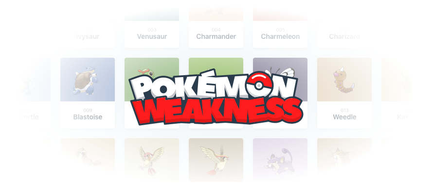
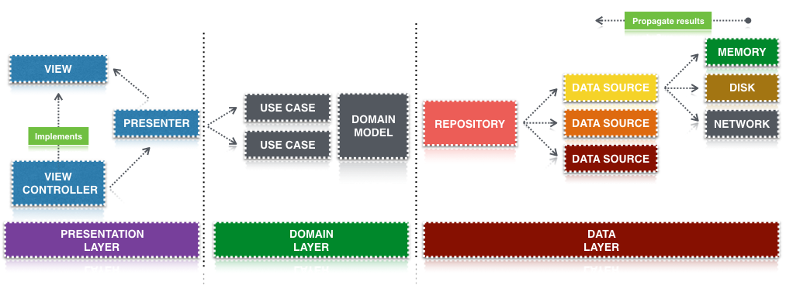

Pokémon Weakness for iOS
------------------------


<a href="https://developer.apple.com/swift"></a>
[](https://fedoraproject.org/wiki/Licensing/Beerware)

This README provides basic information for some of the most commong tasks you'll have to perform during the development of the app.

## Requirements

* iOS 9.0+
* Xcode 7.0+

## Downloading and installing the project

You'll need a few things before getting started. Make sure you have the latests Xcode installed from the AppStore or Developer Site. Then you can clone the project with the following command:

```bash
git clone https://github.com/pokeweak/pokemon-weakness-ios.git
```

After cloning the project you'll need to install [Bundler](http://bundler.io/) to manage all the Ruby dependencies on the project for building the project

```bash
sudo gem install bundler
```

After this just execute the following command to install all needed gems

```bash
sudo bundle install
```

## Getting started

Now that you've downloaded the project you'll need to run the app, we can run the app using [Xcode 7](https://developer.apple.com/xcode/downloads/). Make sure to open the `Pokemon Weakness.xcworkspace` workspace, and not the `Pokemon Weakness.xcodeproj` project.
Currently, the project is compatible with `Xcode 7` only, as it's `Swift 2`.

## CocoaPods

[CocoaPods](https://cocoapods.org/) is a dependency manager for Objective-C & Swift, which automates and simplifies the process of using 3rd-party libraries in your projects. To learn more about this amazing tool you can check the their [docs](https://guides.cocoapods.org/). 

## Architecture 🎯



The app is build on top of `my understanding` of [MVP pattern](https://en.wikipedia.org/wiki/Model%E2%80%93view%E2%80%93presenter) and trying to model the app so it can follow [SOLID principles](https://en.wikipedia.org/wiki/SOLID_(object-oriented_design))

## Connect

All this layers are connected using [Promisekit](http://promisekit.org/) for the asynchronous part and we are married to `PromiseKit`  ¯\(ツ)/¯

## Dependency injection 💉

Dependency injection is has been achieved by using [Service Locator](https://msdn.microsoft.com/es-es/library/ff648968.aspx) pattern with an `Assembly` that's the one in charge of keeping all the references, I took this approach by using swift extensions of this `Assembly` so it's easier to link dependencies.

## Libraries used in this project

* [PromiseKit](https://github.com/mxcl/PromiseKit)
* [SDWebImage](https://github.com/rs/SDWebImage)
* [PopupDialog](https://github.com/Orderella/PopupDialog)
* [DZNEmptyDataSet](https://github.com/dzenbot/DZNEmptyDataSet)
* [Quick](https://github.com/Quick/Quick)
* [Nimble](https://github.com/Quick/Nimble)

## Contact

[](https://twitter.com/skyweb07)

## License 🍺

Source is realeased under [Beerware](https://es.wikipedia.org/wiki/Beerware) license:

```bash
As long as you retain this notice you can do whatever you want with this stuff. If we meet some day, and you think this stuff is worth it, you can buy me a beer in return.
```

